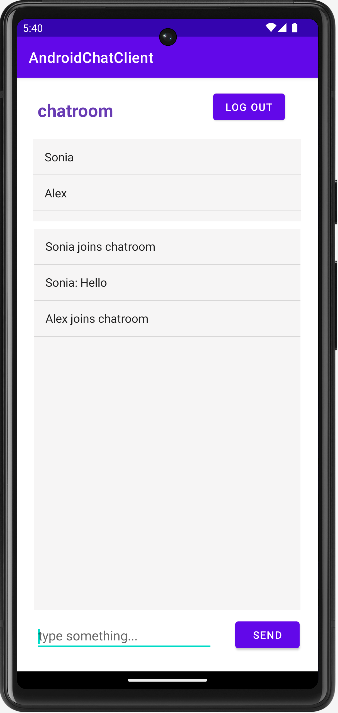

# ChatRooms
A chat app with rooms. The server is written in Java. The client-side is written in bothHTML/CSS/JavaScript (web app) and Java (Android app).

## Introductions

### Server
1. Use threads to handle HTTP requests and Web Socket requests

2. One client can enter multiple rooms, and the room will record clients's join, leave, and messages

3. The messages are in JSON format, and are stored in files named as the room

### Web app

### Android app

## Credits

This game is my course project for the course CS6011 at MSD program. Thanks Dave for designing such a interesting program.
